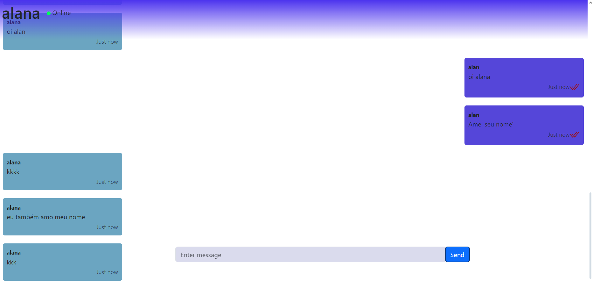

# About ChitChat

ChitChat e um aplicativo de bate papo que usa React.js no frontend, Node.js no backend e [socketIO](https://socket.io) para permitir o envio de mensagens entre usuários de uma forma mais rápida.

[documentação frontend](client/README.md)

[documentação backend](server/README.md)

